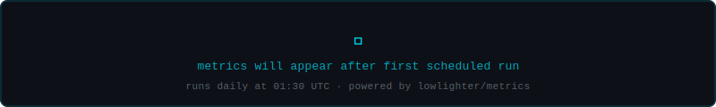

<!-- ════════════════════════════════════════════════════════════════════════ -->
<!--  NikoMix · GitHub Profile README                                         -->
<!--  Theme: sleek dark neon / cyber · palette #00E5FF #7C4DFF #FF2EC4        -->
<!--  Built with free, license-free, open-source tooling.                     -->
<!-- ════════════════════════════════════════════════════════════════════════ -->

<a href="https://www.mixmedia.dev">
  
</a>

<div align="center">

<a href="https://www.mixmedia.dev">
  
</a>

<br/>

<!-- identity strip -->


<br/><br/>

<!-- social neon badges -->
<a href="https://www.linkedin.com/in/niko-mix/"></a>
<a href="https://www.mixmedia.dev"></a>
<a href="https://dev.to/nikomix"></a>
<a href="https://stackoverflow.com/users/6499664/niko-mix"></a>
<a href="https://x.com/MixNiko"></a>
<a href="https://www.microsoft.com"></a>

</div>

## 🧬 About me

```yaml
name:        Niko Mix
role:        Sr. Partner Solution Architect @ Microsoft
focus:       Cloud & AI Platforms · SME&C · EMEA
location:    Germany 🇩🇪
mission:     turn partner capabilities into production-grade platforms
```

- 🔭 &nbsp;Architecting **Cloud & AI platform** solutions with Microsoft partners across **EMEA**.
- 🤝 &nbsp;I help partners turn Azure into platforms — **AI apps, AKS, hybrid cloud, agentic DevOps, AVD, SAP on Azure**.
- 🌱 &nbsp;Deep-diving **Azure AI Foundry**, agentic systems, and platform engineering.
- 💬 &nbsp;Ask me about **Azure**, **AI platforms**, **Kubernetes**, **hybrid cloud** & **partner specializations**.
- ⚡ &nbsp;Maker at heart — author of the **MixMedia** open-source libraries (Philips JointSpace, UPnP).
- 📫 &nbsp;Reach me through any of the badges above.

## 🛠️ Tech & cloud stack

<div align="center">

<h3 align="center">☁️ Cloud &amp; Platforms</h3>


<h3 align="center">🤖 AI &amp; Data</h3>


<h3 align="center">💻 Languages</h3>


<h3 align="center">⚙️ DevOps &amp; Tooling</h3>


</div>

## 📊 GitHub stats

<div align="center">


<br/>


</div>

## 📈 Contribution graph

<div align="center">


</div>

## 🏆 Highlights

<div align="center">

<!-- Self-hosted, committed by the metrics workflow — no external view-time dependency. -->


</div>

<div align="center">

## 🤝 Let's connect

<a href="https://www.linkedin.com/in/niko-mix/"></a>
<a href="https://www.mixmedia.dev"></a>
<a href="https://dev.to/nikomix"></a>
<a href="https://stackoverflow.com/users/6499664/niko-mix"></a>
<a href="https://x.com/MixNiko"></a>

<br/><br/>


</div>
